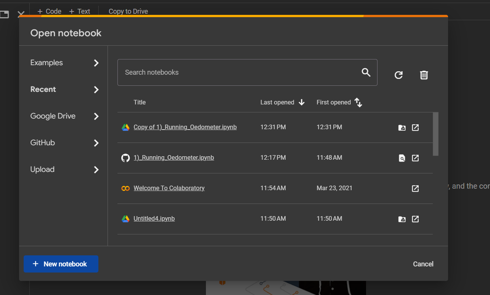
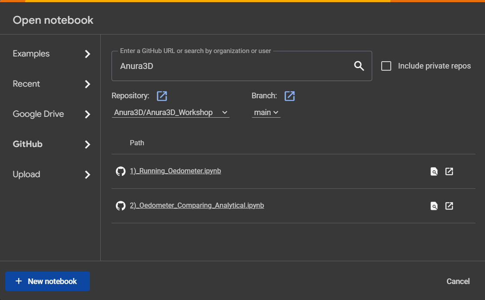

# Instructions to use and analyze Oedometer model using Google Colab

## Setting up Google Colab

1) Go to [Google Colab](https://colab.research.google.com/)
2) If the below screen directly shows click Github. Otherwise select ```File-> Open Notebook``` on the top left of the menu.



3) Search for Anura3D and select Anura3D_Workshop


4) Click ```1)_Running_Oedometer.ipynb```. This should open the Jupyter notebook

## Running the Jupyter Notebook   
1) Cells can be run one by one, using the play button on the left of the cell or all at once, by clicking ```Runtime -> Run all``` in the top menu.

2) The model should run automatically and the process of running the model is done.

## Processing the data


